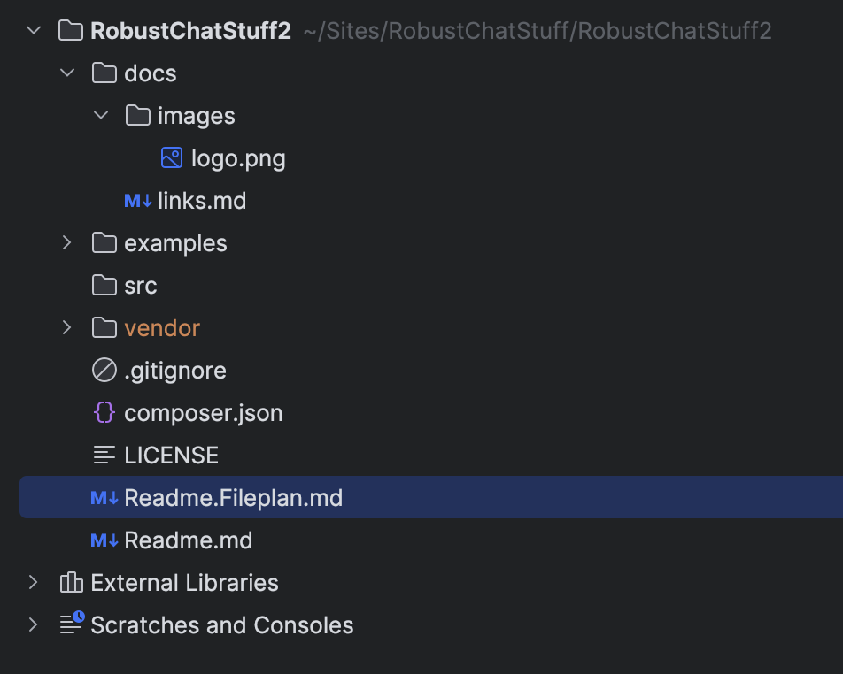

/docs = images and docs, beyond the root `.\Readme.md` file.

/examples = Stand-alone working demonstrations of how to work with AI

/vendor = stuff installed by composer

/src = code to run this

The `Readme.md` files, sprinkled throughout the structure, will automatically be publish to the github.io pages as public documention.
Because of this, you might see an `index.php` file adjacent to a readme file to facilitate visiting the examples
on a local installation.
